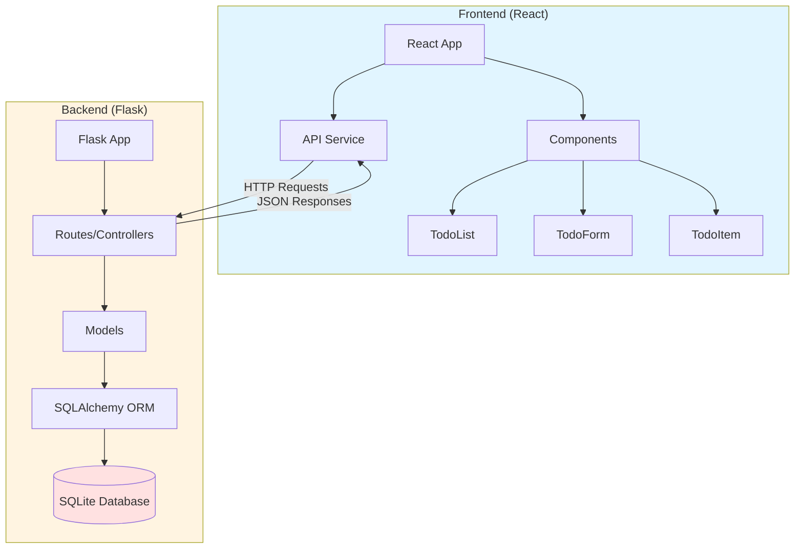
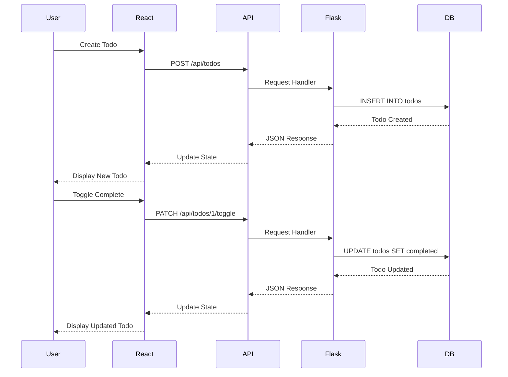

# Todo Application - Technical Plan

## Project Overview

A single-user todo application with:
- **Backend**: Python Flask REST API
- **Frontend**: React (JavaScript)
- **Database**: SQLite (local storage)
- **Features**: Full CRUD operations for todo items

---

## 1. Project Directory Structure

```
todo-app/
├── backend/
│   ├── app/
│   │   ├── __init__.py           # Flask app factory
│   │   ├── models.py             # Database models
│   │   ├── routes.py             # API endpoints
│   │   ├── config.py             # Configuration settings
│   │   └── database.py           # Database initialization
│   ├── migrations/               # Database migrations (Flask-Migrate)
│   ├── tests/
│   │   ├── __init__.py
│   │   ├── test_routes.py        # API endpoint tests
│   │   └── test_models.py        # Model tests
│   ├── venv/                     # Virtual environment (not in git)
│   ├── requirements.txt          # Python dependencies
│   ├── run.py                    # Application entry point
│   └── .env                      # Environment variables (not in git)
│
├── frontend/
│   ├── public/
│   │   ├── index.html            # HTML template
│   │   └── favicon.ico
│   ├── src/
│   │   ├── components/
│   │   │   ├── TodoList.jsx      # Todo list display
│   │   │   ├── TodoItem.jsx      # Individual todo item
│   │   │   ├── TodoForm.jsx      # Add/edit todo form
│   │   │   └── TodoFilter.jsx    # Filter/search component
│   │   ├── services/
│   │   │   └── api.js            # API service layer
│   │   ├── styles/
│   │   │   └── App.css           # Application styles
│   │   ├── App.jsx               # Main React component
│   │   ├── index.js              # React entry point
│   │   └── config.js             # Frontend configuration
│   ├── package.json              # Node dependencies
│   ├── package-lock.json
│   └── .env                      # Environment variables (not in git)
│
├── .gitignore                    # Git ignore file
├── README.md                     # Project documentation
└── docker-compose.yml            # Optional: Docker setup
```

**Rationale:**
- **Separation of concerns**: Backend and frontend are clearly separated for independent development and deployment
- **Modular structure**: Components, services, and models are organized logically
- **Scalability**: Easy to add new features (authentication, categories, etc.) in the future
- **Testing**: Dedicated test directories for both backend and frontend
- **Configuration**: Environment-specific settings isolated in `.env` files

---

## 2. API Endpoints

### Base URL
```
http://localhost:5000/api
```

### Endpoints Specification

#### 1. Get All Todos
```
GET /api/todos
```
**Query Parameters:**
- `status` (optional): Filter by status (all, active, completed)
- `search` (optional): Search in title and description

**Response (200 OK):**
```json
{
  "success": true,
  "data": [
    {
      "id": 1,
      "title": "Buy groceries",
      "description": "Milk, eggs, bread",
      "completed": false,
      "priority": "medium",
      "created_at": "2026-02-15T08:00:00Z",
      "updated_at": "2026-02-15T08:00:00Z"
    }
  ],
  "count": 1
}
```

#### 2. Get Single Todo
```
GET /api/todos/<id>
```

**Response (200 OK):**
```json
{
  "success": true,
  "data": {
    "id": 1,
    "title": "Buy groceries",
    "description": "Milk, eggs, bread",
    "completed": false,
    "priority": "medium",
    "created_at": "2026-02-15T08:00:00Z",
    "updated_at": "2026-02-15T08:00:00Z"
  }
}
```

**Response (404 Not Found):**
```json
{
  "success": false,
  "error": "Todo not found"
}
```

#### 3. Create Todo
```
POST /api/todos
```

**Request Body:**
```json
{
  "title": "Buy groceries",
  "description": "Milk, eggs, bread",
  "priority": "medium"
}
```

**Validation Rules:**
- `title`: Required, 1-200 characters
- `description`: Optional, max 1000 characters
- `priority`: Optional, enum (low, medium, high), default: medium

**Response (201 Created):**
```json
{
  "success": true,
  "data": {
    "id": 1,
    "title": "Buy groceries",
    "description": "Milk, eggs, bread",
    "completed": false,
    "priority": "medium",
    "created_at": "2026-02-15T08:00:00Z",
    "updated_at": "2026-02-15T08:00:00Z"
  },
  "message": "Todo created successfully"
}
```

**Response (400 Bad Request):**
```json
{
  "success": false,
  "error": "Validation error",
  "details": {
    "title": "Title is required"
  }
}
```

#### 4. Update Todo
```
PUT /api/todos/<id>
```

**Request Body (all fields optional):**
```json
{
  "title": "Buy groceries and cook",
  "description": "Updated description",
  "completed": true,
  "priority": "high"
}
```

**Response (200 OK):**
```json
{
  "success": true,
  "data": {
    "id": 1,
    "title": "Buy groceries and cook",
    "description": "Updated description",
    "completed": true,
    "priority": "high",
    "created_at": "2026-02-15T08:00:00Z",
    "updated_at": "2026-02-15T09:00:00Z"
  },
  "message": "Todo updated successfully"
}
```

#### 5. Delete Todo
```
DELETE /api/todos/<id>
```

**Response (200 OK):**
```json
{
  "success": true,
  "message": "Todo deleted successfully"
}
```

#### 6. Toggle Todo Status
```
PATCH /api/todos/<id>/toggle
```

**Response (200 OK):**
```json
{
  "success": true,
  "data": {
    "id": 1,
    "completed": true
  },
  "message": "Todo status toggled successfully"
}
```

#### 7. Bulk Delete
```
DELETE /api/todos/bulk
```

**Request Body:**
```json
{
  "ids": [1, 2, 3]
}
```

**Response (200 OK):**
```json
{
  "success": true,
  "message": "3 todos deleted successfully",
  "deleted_count": 3
}
```

#### 8. Get Statistics
```
GET /api/todos/stats
```

**Response (200 OK):**
```json
{
  "success": true,
  "data": {
    "total": 10,
    "completed": 5,
    "active": 5,
    "by_priority": {
      "low": 3,
      "medium": 4,
      "high": 3
    }
  }
}
```

### Error Handling

All endpoints follow consistent error response format:

```json
{
  "success": false,
  "error": "Error message",
  "details": {}  // Optional: additional error details
}
```

**HTTP Status Codes:**
- `200 OK`: Successful GET, PUT, PATCH, DELETE
- `201 Created`: Successful POST
- `400 Bad Request`: Validation errors
- `404 Not Found`: Resource not found
- `500 Internal Server Error`: Server errors

---

## 3. Database Schema

### Todo Model

**Table Name:** `todos`

| Column | Type | Constraints | Description |
|--------|------|-------------|-------------|
| id | INTEGER | PRIMARY KEY, AUTOINCREMENT | Unique identifier |
| title | VARCHAR(200) | NOT NULL | Todo title |
| description | TEXT | NULLABLE | Detailed description |
| completed | BOOLEAN | NOT NULL, DEFAULT FALSE | Completion status |
| priority | VARCHAR(10) | NOT NULL, DEFAULT 'medium' | Priority level (low, medium, high) |
| created_at | DATETIME | NOT NULL, DEFAULT CURRENT_TIMESTAMP | Creation timestamp |
| updated_at | DATETIME | NOT NULL, DEFAULT CURRENT_TIMESTAMP | Last update timestamp |

**Indexes:**
- Primary index on `id`
- Index on `completed` for filtering
- Index on `created_at` for sorting

**SQLAlchemy Model Definition:**
```python
from datetime import datetime
from app.database import db

class Todo(db.Model):
    __tablename__ = 'todos'
    
    id = db.Column(db.Integer, primary_key=True)
    title = db.Column(db.String(200), nullable=False)
    description = db.Column(db.Text, nullable=True)
    completed = db.Column(db.Boolean, default=False, nullable=False)
    priority = db.Column(db.String(10), default='medium', nullable=False)
    created_at = db.Column(db.DateTime, default=datetime.utcnow, nullable=False)
    updated_at = db.Column(db.DateTime, default=datetime.utcnow, onupdate=datetime.utcnow, nullable=False)
    
    def to_dict(self):
        return {
            'id': self.id,
            'title': self.title,
            'description': self.description,
            'completed': self.completed,
            'priority': self.priority,
            'created_at': self.created_at.isoformat(),
            'updated_at': self.updated_at.isoformat()
        }
```

**Future Scalability Considerations:**
- Ready to add `user_id` foreign key for multi-user support
- Can add `category_id` for todo categorization
- Can add `due_date` field for deadline tracking
- Can add `tags` relationship for flexible organization

---

## 4. Technology Stack Recommendations

### Backend Stack

#### Core Framework
- **Flask 3.0+**
  - Lightweight, flexible, perfect for REST APIs
  - Extensive ecosystem of extensions
  - Easy to learn and maintain

#### Essential Flask Extensions

1. **Flask-SQLAlchemy 3.1+**
   - ORM for database operations
   - Simplifies database queries and relationships
   - Provides migration support with Flask-Migrate

2. **Flask-Migrate 4.0+**
   - Database migration management (built on Alembic)
   - Version control for database schema
   - Essential for schema evolution

3. **Flask-CORS 4.0+**
   - Handle Cross-Origin Resource Sharing
   - Required for React frontend to communicate with Flask backend
   - Simple configuration for development and production

4. **Flask-Marshmallow 1.2+** (with marshmallow-sqlalchemy)
   - Serialization/deserialization of complex data types
   - Request validation
   - Response formatting

5. **python-dotenv 1.0+**
   - Load environment variables from `.env` file
   - Separate configuration for development/production

#### Additional Libraries

- **SQLite3** (built-in Python)
  - Zero-configuration database
  - Perfect for single-user application
  - File-based, no server required
  - Easy to backup and migrate

- **pytest 8.0+** (testing)
  - Modern testing framework
  - Better than unittest for Flask apps
  - Fixtures and plugins ecosystem

- **pytest-flask 1.3+**
  - Flask-specific testing utilities
  - Test client and fixtures

**Backend requirements.txt:**
```
Flask==3.0.0
Flask-SQLAlchemy==3.1.1
Flask-Migrate==4.0.5
Flask-CORS==4.0.0
Flask-Marshmallow==1.2.0
marshmallow-sqlalchemy==1.0.0
python-dotenv==1.0.0
pytest==8.0.0
pytest-flask==1.3.0
```

### Frontend Stack

#### Core Framework
- **React 18+**
  - Component-based architecture
  - Virtual DOM for performance
  - Large ecosystem and community
  - Hooks for state management

#### Build Tool
- **Vite 5+**
  - Fast development server with HMR (Hot Module Replacement)
  - Optimized production builds
  - Better than Create React App for modern projects
  - Native ES modules support

#### HTTP Client
- **Axios 1.6+**
  - Promise-based HTTP client
  - Interceptors for request/response handling
  - Better error handling than fetch
  - Automatic JSON transformation

#### State Management
- **React Context API** (built-in)
  - Sufficient for simple single-user app
  - No external dependencies
  - Easy to upgrade to Redux/Zustand later if needed

#### UI/Styling Options

**Option 1: Tailwind CSS** (Recommended)
- Utility-first CSS framework
- Rapid development
- Small production bundle
- Highly customizable

**Option 2: Material-UI (MUI)**
- Pre-built React components
- Professional look out of the box
- More opinionated design

**Option 3: Custom CSS**
- Full control over styling
- Lighter weight
- More development time

**Recommendation:** Tailwind CSS for balance of speed and customization

#### Additional Libraries

- **React Router DOM 6+**
  - Client-side routing (if adding multiple pages later)
  - Not essential for single-page todo app initially

- **React Icons 5+**
  - Icon library
  - Lightweight, tree-shakeable

- **date-fns 3+**
  - Date formatting and manipulation
  - Lighter than moment.js

**Frontend package.json dependencies:**
```json
{
  "dependencies": {
    "react": "^18.2.0",
    "react-dom": "^18.2.0",
    "axios": "^1.6.0",
    "react-icons": "^5.0.0",
    "date-fns": "^3.0.0"
  },
  "devDependencies": {
    "@vitejs/plugin-react": "^4.2.0",
    "vite": "^5.0.0",
    "tailwindcss": "^3.4.0",
    "autoprefixer": "^10.4.0",
    "postcss": "^8.4.0"
  }
}
```

### Development Tools

#### Version Control
- **Git** with `.gitignore` for Python and Node.js

#### Code Quality

**Backend:**
- **Black** - Code formatter
- **Flake8** - Linting
- **isort** - Import sorting

**Frontend:**
- **ESLint** - JavaScript linting
- **Prettier** - Code formatting

#### API Testing
- **Postman** or **Thunder Client** (VS Code extension)
- **pytest** for automated backend tests

#### Database Management
- **DB Browser for SQLite** - Visual database inspection
- **Flask-Migrate** CLI for migrations

---

## 5. Architecture Diagram



---

## 6. Data Flow Diagram



---

## 7. Development Workflow

### Phase 1: Backend Setup
1. Initialize Flask project structure
2. Set up virtual environment and install dependencies
3. Configure Flask app and database
4. Create Todo model
5. Implement API endpoints
6. Add input validation and error handling
7. Write unit tests for API endpoints
8. Test with Postman/Thunder Client

### Phase 2: Frontend Setup
1. Initialize React project with Vite
2. Set up Tailwind CSS
3. Create component structure
4. Implement API service layer
5. Build UI components
6. Implement state management
7. Add error handling and loading states
8. Style and polish UI

### Phase 3: Integration
1. Configure CORS on backend
2. Connect frontend to backend API
3. Test all CRUD operations
4. Handle edge cases and errors
5. Add loading indicators
6. Implement filtering and search

### Phase 4: Testing & Polish
1. End-to-end testing
2. Fix bugs and edge cases
3. Optimize performance
4. Add documentation
5. Prepare for deployment

---

## 8. Configuration Management

### Backend Configuration (.env)
```
FLASK_APP=run.py
FLASK_ENV=development
SECRET_KEY=your-secret-key-here
DATABASE_URI=sqlite:///todos.db
CORS_ORIGINS=http://localhost:5173
```

### Frontend Configuration (.env)
```
VITE_API_BASE_URL=http://localhost:5000/api
```

---

## 9. Running the Application

### Backend
```bash
cd backend
python -m venv venv
source venv/bin/activate  # On Windows: venv\Scripts\activate
pip install -r requirements.txt
flask db init
flask db migrate -m "Initial migration"
flask db upgrade
python run.py
```

### Frontend
```bash
cd frontend
npm install
npm run dev
```

**Access:**
- Frontend: http://localhost:5173
- Backend API: http://localhost:5000/api

---

## 10. Future Enhancements (Out of Scope)

These features can be added later without major refactoring:

1. **User Authentication**
   - Add User model
   - JWT token-based auth
   - User-specific todos

2. **Categories/Tags**
   - Organize todos by category
   - Multiple tags per todo

3. **Due Dates & Reminders**
   - Add due_date field
   - Email/push notifications

4. **Collaboration**
   - Share todos with others
   - Comments and attachments

5. **Advanced Filtering**
   - Date range filters
   - Complex search queries
   - Saved filters

6. **Data Export**
   - Export to CSV/JSON
   - Backup and restore

7. **Dark Mode**
   - Theme toggle
   - Persistent preference

---

## 11. Best Practices & Recommendations

### Backend
- Use Flask application factory pattern for better testing
- Implement proper error handling with custom exceptions
- Use environment variables for all configuration
- Write comprehensive tests (aim for >80% coverage)
- Use database migrations for all schema changes
- Implement request validation with Marshmallow schemas
- Add API versioning (e.g., /api/v1/todos) for future compatibility

### Frontend
- Keep components small and focused (Single Responsibility)
- Use custom hooks for reusable logic
- Implement proper error boundaries
- Add loading states for all async operations
- Use PropTypes or TypeScript for type checking
- Optimize re-renders with React.memo when needed
- Implement debouncing for search functionality

### Security
- Validate all user input on backend
- Use parameterized queries (SQLAlchemy handles this)
- Set appropriate CORS policies
- Add rate limiting for API endpoints (future enhancement)
- Sanitize user input to prevent XSS

### Performance
- Add database indexes on frequently queried fields
- Implement pagination for large todo lists
- Use React.lazy for code splitting (if app grows)
- Optimize bundle size with tree shaking
- Cache API responses when appropriate

---

## 12. Estimated Development Time

| Phase | Estimated Time |
|-------|----------------|
| Backend Setup & API | 4-6 hours |
| Frontend Setup & Components | 4-6 hours |
| Integration & Testing | 2-3 hours |
| Polish & Documentation | 1-2 hours |
| **Total** | **11-17 hours** |

---

## Summary

This technical plan provides a solid foundation for building a modern, maintainable todo application. The architecture is simple enough for quick development but structured to allow future enhancements like user authentication, categories, and collaboration features. The chosen technology stack (Flask + React + SQLite) is well-suited for a single-user application while remaining scalable for future growth.

**Key Strengths:**
- Clear separation of concerns (backend/frontend)
- RESTful API design following best practices
- Modern, component-based frontend with React
- Lightweight, zero-configuration database
- Comprehensive error handling and validation
- Ready for future enhancements

**Next Steps:**
1. Review and approve this technical plan
2. Set up development environment
3. Begin implementation following the phased approach
4. Iterate based on testing and feedback